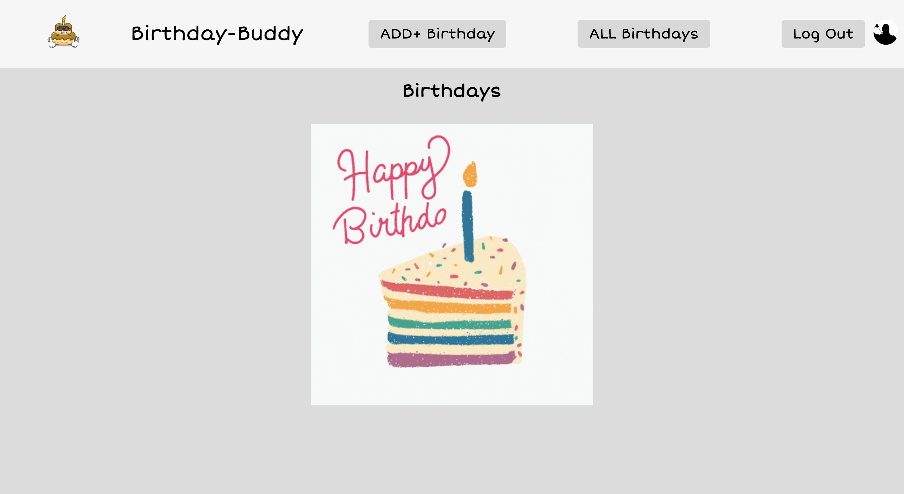

# Birthday-Buddy
It can get hectic remembering all your friends and family's birthdays. But, with Birthday-Buddy, you can effortlessly create reminders for all of your loved ones.

In order to gain access to your birthday reminders you must log in. If you wish to add a birthdate you can do so by clicking the "Add Bday" button in the navigation bar. Once you're in the "Add Bday" link you can put in your details and also add possible gifts.

If you want to view more information on a certain birthdate, click on "More Info". You can update or change information by selecting "Edit". If you want to remove a birthday reminder from Birthday-Buddy, use the X button.

I developed this application with the purpose of helping people keep track of important dates such as the birthdays of their friends and family. It's not easy to remember all of these dates on your own, but with Birthday-Buddy, you can easily record and store all of your loved one's special days with minimal effort.

## Getting Started 🥳

### [Get to Birthday Reminding Now!](https://birthday-buddy.fly.dev/)

Project planning materials [here](https://trello.com/c/eLvAclQS/15-imagepng)

## Credits

### Images 🌇:
* [Favicon](https://favicon.io/emoji-favicons/birthday-cake/)
* [Cake-Background](https://gifdb.com/images/high/happy-birthday-cake-rainbow-slice-candle-fbr7ycwj98vxiah2.gif)
* [Birthday-Buddy](https://thumbs.dreamstime.com/b/super-cool-birthday-cake-character-cartoon-super-cool-birthday-cake-character-cartoon-vector-illustration-117210954.jpg)

## Technologies Used 📡
* Mongoose
* MongoDB
* Express
* Node.js
* Fly.io
* HTML
* CSS
* Javascript
* Chrome DevTools
* Git 
* [Fonts](https://fonts.google.com/share?selection.family=Short%20Stack)

## Ice Box 🧊
* Add different color themes
* Add calender 
* Add astrology filter
* Add birthday reminders to text
* Add optional contact info

